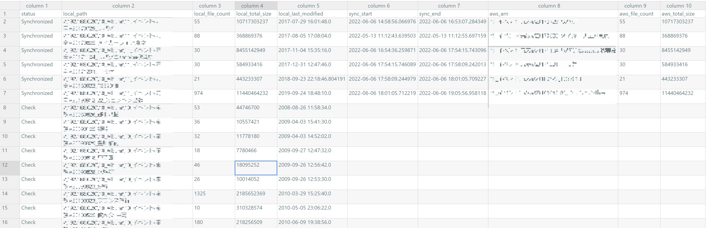
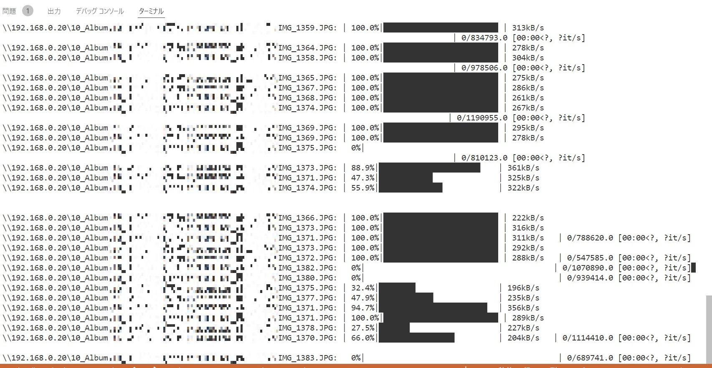

# 写真や動画をS3 Glacier Deep Archiveにバックアップ

## What's AWS S3 Glacier Deep Archive
1TB1ドル/月でバックアップできる超格安ストレージ

* 保存料金 0.00099USD/GB（オハイオリージョン）
* 1000リクエストあたり 0.05ドル
* 最小保存期間 180日
    * すぐに削除したとしても180日分の料金が発生する
* 取り出し時間（大容量） 48時間
    * 取り出しまでにかかる時間

まさに氷河(Glacier)のようなストレージなので、2次的なバックアップのバックアップに向いている。家ではNAS管理している写真を、火災や地震から守ることができそう。リクエスト回数にも課金されるので、ファイルがたくさんあるときは注意が必要。


### 料金試算
20万枚、合計2TBとすると

オハイオリージョン
* 初回アップロード 
    * PUTリクエスト 0.05*200000/1000=10ドル
* 維持費
    * 0.00099*2000 = 1.98ドル/月
* データ取り出し
    * GETリクエスト 0.05*200000/1000=10ドル
    * 大容量取り出し費用(1GBあたり) 0.0025*2000=5ドル

(この試算はあくまで私の理解に基づく概算なので、各自でよくよく調べてください。)


# 何ができる？

* こんな感じで写真や動画などが管理されている構成を想定しており、指定フォルダをAWS Glacierに並列アップロードできる。
  * 何階層目をバックアップの単位にするか設定できる
    ```
    Album_root
    ├─2021
    │ └─0401_帰省
    └─2022
      ├─0601_運動会
      └─0501_旅行
    ```
* AWSとローカルの簡易的な同期支援
  * AWSアップロード時点のローカルの写真フォルダの中身の個数・ファイルサイズ・最終更新日をメモし、ローカルに変更などがあった場合にそれを発見することができる。
  * こんな感じのcsvがメモ用に生成されます
  
|status      |local_path|local_file_count|local_total_size|local_last_modified       |sync_start                |sync_end                  |aws_arn|aws_file_count|aws_total_size|
|------------|----------|----------------|----------------|--------------------------|--------------------------|--------------------------|-------|--------------|--------------|
|Synchronized|test\a    |3               |6               |2022-05-09 23:20:12.345128|2022-05-11 22:09:15.400879|2022-05-11 22:09:17.059253|test/a |3             |6             |
|Synchronized|test\c    |1               |3               |2022-05-09 23:20:49.419508|2022-05-11 22:24:41.882182|2022-05-11 22:24:43.961263|test/c |1             |3             |
|Check       |test\b    |3               |42              |2022-05-09 23:20:45.318020|                          |                          |       |              |              |

# 準備 

## AWS

1. AWSアカウント作成する
1. S3バケットを作成する
2. IAMポリシー、ユーザ作成する
  [AWSのS3だけ使えるIAMの作成手順 \| 酒と涙とRubyとRailsと](https://morizyun.github.io/infrastructure/aws-s3-with-iam-policy.html)
3. AWS CLIインストールする
4. `aws config`で認証の設定をする

## Python

1. instal python 3.8
1. (option) make python virtual env
1. run `pip install -r requirement.txt`

# 使いかた

1. main.pyの上部の変数を自分の環境に合わせて変更する
    ```python
    ### ユーザ設定 ###
    # バックアップ対象の親ディレクトリ
    target_top_path = pathlib.Path(r"\\192.168.0.20\10_Album")
    # 親ディレクトリから何階層下をバックアップの単位とするか
    target_level = 2
    # スキップするファイル・フォルダ
    skip_file_list = ["Thumbs.db", ".DS_store"]
    skip_folder_list = ["#recycle", "90_Temp", "91_要整理"]
    # aws設定
    bucket_name = "album-backup"
    # アップロードの並列数
    upload_concurrency = 10
    # debug mode
    dry_run = False  # AWSへのアップロードを行わない
    Glacier_off = False  # AWS S3 Glacierへのアップロードを行わず、通常のS3にアップロードする
    ### ユーザ設定ここまで ###
    ```
1. main.pyを実行する `python main.py`
1. 対象フォルダがチェックされ、status.csvが生成される
    
1. status.csvのうち、バックアップしたいフォルダの1列目(status)を`Check`から`Upload`に変えて保存

    status列目の意味
    ```
    Check = auto()  # 初回またはローカルのファイル数か最終更新日に変更がある
    Check_NotExists = auto()  # ローカルのファイルパスが見つからない
    Check_FileUpload = auto()  # アップロード途中で終了している
    Upload = auto()  # Upload対象（ユーザーが手動で変更する）
    Synchronized = auto()  # アップロード完了
    ```

1. main.pyを実行する `python main.py`ローカルファイルの更新チェックが走り、その後status列が`Upload`のものがAWSにアップロードされる。
    
1. 次回以降も `python main.py`を実行すると`status.csv`の更新とアップロードが行われるので、`status.csv`は大切に保管しておく。

